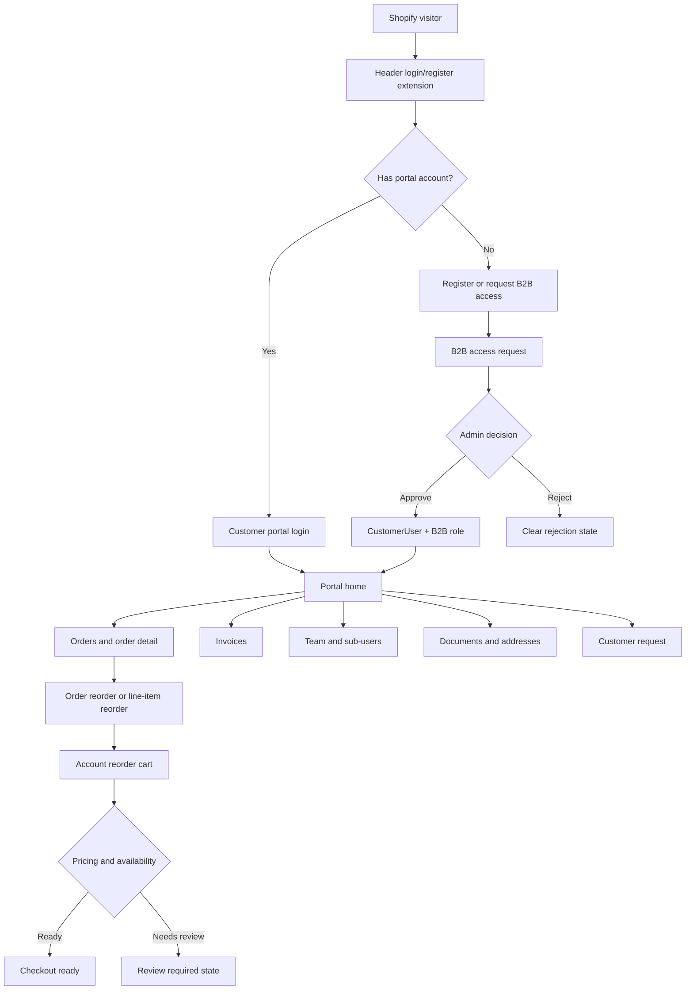

# Customer Lifecycle UIX Story

Bu dokumanin amaci, Factory Engine Pro'da musteri yasam dongusunun panelde %100 calisir, anlasilir ve dogru veriyle beslenir hale gelmesi icin urun hikayesini netlestirmektir.

Bu bir teknik endpoint listesi degil. Bu, musterinin Shopify magazasinda baslayip kendi hesap panelinde siparis, fatura, reorder, ekip ve B2B fiyat akisini sorunsuz yasamasini anlatan UIX hikayesidir.

## Ana Ilke

Musteri paneli bir "admin panelinin kucuk versiyonu" degildir. Musteri paneli, musterinin kendi hesabiyla ilgili en onemli sorulara hizli cevap verdigi yerdir:

- Siparislerim nerede?
- Ayni urunu tekrar alabilir miyim?
- Hangi faturalarim acik?
- Ekip uyelerim ne gorebilir veya ne yapabilir?
- B2B fiyatim, indirimim veya tier'im dogru uygulanmis mi?
- Destek veya B2B basvurum hangi durumda?

Her ekran bu sorulardan birine cevap vermeli. Cevap yoksa bos alan degil, anlamli bos durum ve ilk aksiyon CTA'i olmalidir.

## 1. Entry: Shopify Header'dan Factory Login'e Gelis

Musteri ilk temasini Shopify storefront uzerinde yasar. Header'a eklenen login/register extension blogu musteriyi bizim hesap sistemimize tasir.

Hikaye:

1. Musteri Shopify sitesinde gezer.
2. Header'da "Login", "Register" veya "B2B Access" girisini gorur.
3. Login'e basarsa bizim accounts login yuzeyine gider.
4. Register'a basarsa kendi hesabini acabilecegi veya davet tokeniyle kaydini tamamlayabilecegi yuzeye gider.
5. B2B olmak istiyorsa request sayfasina gider.

UIX beklentisi:

- Musteri nerede oldugunu anlamali: marka, hesap tipi, guvenli giris mesaji.
- Login, register, forgot password ve request invitation birbirine karismamali.
- Shopify musteri oturumu ile bizim CustomerUser oturumu arasindaki fark UI'da kafa karistirmamali.
- Auth route'lari sade olmali; sidebar veya portal chrome gosterilmemeli.

Kabul:

- Header login/register tiklaninca dogru accounts route acilir.
- Login basarili olunca musteri ana hesap paneline gider.
- Oturum yoksa korumali route'lar login'e doner.
- Oturum varsa login/register sayfasi ana panele yonlendirir.

## 2. Guest veya Shopify Customer Durumu

Sistemde her Shopify musterisi portal kullanicisi olmak zorunda degildir. Shopify tarafinda bir musteri kaydi olabilir ama bizim hesap sistemimizde aktif CustomerUser olmayabilir.

Hikaye:

1. Shopify'da musteri vardir.
2. Bizim sistemde `Customer` olarak gorunur.
3. Henuz portal login'i yoksa normal musteri statusundedir.
4. Portal hesabi acarsa `CustomerUser` olur.
5. B2B onayi alirsa B2B yetkileri ve team yonetimi acilir.

UIX beklentisi:

- Normal musteri portalda sadece kendi siparis, adres, destek ve temel reorder alanlarini gormeli.
- B2B olmayan musteri ekip, ozel fiyat veya fatura yetkisi yoksa bu ekranlarda kafa karistiran bos tablolar gormemeli.
- B2B ozellikleri kilitliyse "B2B access request" aksiyonu net gorunmeli.

Kabul:

- `Customer` kaydi ile `CustomerUser` karistirilmaz.
- Login olamayan Shopify musterisi icin net register veya request invitation yolu vardir.
- B2B olmayan musteri B2B-only ozellikleri yanlis kullanamaz.
- Shopify Customer Account extension once link-status okur; portal hesabi yoksa teknik hata yerine register/request/sign-in aksiyonlari gosterir.
- Accounts web portal her route acilisinda gercek `/auth/me` principal permission'larini okur; izinsiz Team, Cart, Reorder veya Invoice URL'leri teknik 403 yerine musteri dostu access state gosterir.

## 3. B2B Access Request

Musteri B2B olmak istediginde request sayfasindan basvuru yapar. Bu basvuru bir support case gibi ele alinmaz; bu bir ticari erisim talebidir.

Hikaye:

1. Musteri request invitation sayfasini acar.
2. Sirket bilgisi, iletisim bilgisi, vergi/sertifika veya gerekli dosyalari girer.
3. Basvuru `B2BAccessRequest` olarak admin tarafina duser.
4. Admin basvuruyu inceler.
5. Onaylanirsa ilgili `Customer` bulunur veya olusturulur.
6. Musteri icin `CustomerUser` olusturulur.
7. Varsayilan B2B owner rolu atanir.
8. Musteri artik B2B panelini kullanabilir.

UIX beklentisi:

- Form uzun ama yorucu olmamali; sirket ve iletisim ayrimi net olmali.
- Dosya yukleme varsa hangi dosyanin neden istendigi yazmali.
- Submit sonrasi "ne olacak" net olmalidir.
- Tekrarlayan request varsa musteriye zaten bekleyen basvuru oldugu soylenmeli.

Kabul:

- Basvuru gercek API ile kaydedilir.
- Admin tarafinda pending olarak gorunur.
- Onay sonrasi CustomerUser ve rol baglantisi olusur.
- Onay veya red karari customer-facing mail delivery proof ile kaydedilir.
- Red durumunda musteriye anlasilir mesaj doner ve admin karar ekraninda bu delivery kaniti gorunur.

## 4. Customer Portal Home

Musteri login oldugunda ilk ekran bir "dashboard" degil, hesap ozeti ve siradaki aksiyon ekrani olmalidir.

Hikaye:

1. Musteri panele girer.
2. Son siparislerini gorur.
3. Acik faturalari varsa uyarilir.
4. Reorder edilebilir urunleri gorur.
5. Aktif cart veya review bekleyen cart varsa kaldigi yerden devam eder.
6. Destek veya request gecmisi varsa son durumunu gorur.

UIX beklentisi:

- Home ekrani musterinin bugun yapmasi gereken seyi one cikarmali.
- Fatura varsa "Pay or review invoices".
- Reorder mumkunse "Reorder again".
- Cart review gerekiyorsa "Continue cart review".
- Hic veri yoksa "No orders yet" gibi bos ama yonlendirici durum olmali.

Gercek veri kaynaklari:

- `GET /customer-account/link-status`
- `GET /customer-account/context`
- profile
- recent orders
- invoices
- reorder templates
- active cart

Kabul:

- Home ekrani seed/mock gostermeden dolar.
- Siparis yoksa bos state gorunur.
- Fatura yoksa fatura alani sakin ve anlasilir olur.
- Hata varsa teknik hata degil musteri dostu mesaj gorunur.

## 5. Orders: Siparis Gecmisi ve Detay

Musteri kendi Shopify siparislerini ve bizim sistemde zenginlestirilmis order detaylarini gorebilmelidir.

Hikaye:

1. Musteri Orders sayfasina girer.
2. Siparis numarasi, tarih, durum, toplam, teslimat veya pickup bilgisi gorur.
3. Siparise tiklayinca line item detaylarini gorur.
4. Her line item icin reorder uygunlugu gorur.
5. Tum siparisi veya sadece bir item'i tekrar sepete ekleyebilir.

UIX beklentisi:

- Order listesi tablo gibi soguk olmamali; her satir "bu sipariste ne oldu" cevabini vermeli.
- Order detail icinde urun, varyant, adet, fiyat, indirim, fulfillment, tracking ve dosya bilgileri net ayrilmali.
- Reorder butonu sadece mumkun oldugunda aktif olmali.
- Uygun olmayan urunde sebep yazmali: stok yok, varyant kapali, fiyat review gerekiyor, minimum quantity gibi.

Gercek veri kaynaklari:

- `GET /customer-account/orders`
- `GET /customer-account/orders/:orderId`
- `POST /customer-account/orders/:orderId/reorder`
- `POST /customer-account/orders/:orderId/line-items/:lineItemId/reorder`

Kabul:

- Musteri sadece kendi order'larini gorur.
- Line item bazli reorder calisir.
- Tum order reorder calisir.
- Reorder sonucunda `AccountReorderCart` olusur.

## 6. Reorder Lifecycle

Reorder, sadece "eski siparisi tekrar al" degildir. Reorder, musterinin onceki isini yeniden uretilebilir, fiyatlanabilir ve checkout'a tasinabilir hale getirme akistir.

Hikaye:

1. Musteri eski siparisten veya reorder templates sayfasindan urun secer.
2. Sistem uygun line item'lari cart'a alir.
3. Cart ilk durumda `review_required`, `unavailable` veya `checkout_ready` olabilir.
4. Stok, varyant, fiyat, minimum adet ve B2B pricing kontrol edilir.
5. Her sey uygunsa checkout hazir olur.
6. Uygun degilse musteri neyin eksik oldugunu gorur.
7. Gerekirse admin/personel review sureci devreye girer.

UIX beklentisi:

- Reorder ekrani musteriyi "tekrar satin alma" niyetinde tutmali.
- Line item kararlarini saklamamali: "available", "needs review", "not available".
- Cart review gerekiyorsa musteri terk edilmemeli; net durum ve sonraki adim gorunmeli.
- Checkout hazirsa tek ana CTA checkout olmalidir.

Gercek veri kaynaklari:

- `GET /customer-account/reorder-templates`
- `GET /customer-account/cart/active`
- `POST /customer-account/cart/:cartId/checkout`
- Accounts checkout service
- CatalogVariant
- PricingRule / B2B price resolver

Kabul:

- Eski order'dan cart olusur.
- Tek item reorder cart olusturur.
- Checkout hazir degilse sebep musteriye okunabilir sekilde doner.
- Checkout hazirsa checkout linki uretilir veya shop/payment akisi acilir.

## 7. B2B Pricing ve Tier Discount

B2B fiyat sistemi, musteriye ozel fiyat ve tier discount mantiginin sistem icinde konfiglenebilir calismasini saglar. Buradaki hedef, musterinin cart veya odeme adiminda kendi fiyatini dogru gormesidir.

Hikaye:

1. Admin B2B pricing rule tanimlar.
2. Rule belirli customer, customer role, segment, tag, product, variant, quantity tier veya zaman araligina baglanir.
3. B2B musteri cart'a urun ekler.
4. Sistem musteriye ait rol, segment, product ve quantity bilgisini okur.
5. Fiyat/discount native olarak hesaplanir.
6. Musteri liste fiyat, kendi fiyat, indirim ve minimum/tier gerekcesini gorur.
7. Checkout'a giderken ayni fiyat karari korunur.

UIX beklentisi:

- "Neden bu fiyat?" sorusuna musteri seviyesinde cevap verilmeli.
- Admin jargonlari gosterilmemeli.
- Tier varsa sonraki esik gosterilmeli: "Add 4 more to reach next tier".
- Discount yoksa bunun nedeni net olmali: role uygun degil, min quantity eksik, product dahil degil.

Gercek veri kaynaklari:

- PricingRule
- CatalogProduct / CatalogVariant
- Customer / CustomerUser / CustomerRole
- AccountReorderCart
- Checkout pricing attempt

Kabul:

- Fiyat cart'ta ve checkout hazirlik sonucunda tutarli olur.
- Rule disabled ise indirim uygulanmaz.
- Quantity tier degisince fiyat yeniden hesaplanir.
- Shopify tarafina bagimli olmayan internal cart fiyat karari ayrica tutulur.

## 8. Invoices: Admin Tarafindan Girilen Faturalar

B2B musteri, adminin hesaba ekledigi resmi faturalarini gorebilmelidir. Bu alan order receipt degildir; payable invoice kayitlaridir.

Hikaye:

1. Admin musteri hesabina fatura ekler.
2. Fatura order'a bagli olabilir veya bagimsiz olabilir.
3. Musteri Invoices sayfasinda faturayi gorur.
4. Balance varsa odeme veya download aksiyonu gorur.
5. Paid, overdue, partial gibi durumlar net gorunur.
6. Muhasebeci sub-user sadece invoice read izniyle buraya girebilir.

UIX beklentisi:

- "Official invoice records only" mantigi korunmali.
- Order receipt ile payable invoice karismamali.
- Fatura detayinda line items, payments, activities ve dosya download olmalidir.
- Online payment yoksa ne yapilacagi yazmali.

Gercek veri kaynaklari:

- `GET /customer-account/invoices`
- `GET /customer-account/invoices/:invoiceId`
- `GET /customer-account/invoices/:invoiceId/download`
- `POST /customer-account/invoices/:invoiceId/pay`
- AccountInvoice
- AccountInvoicePayment
- AccountInvoiceActivity

Kabul:

- Musteri sadece kendi faturasini gorur.
- SubUser permission yoksa invoice goruntuleyemez.
- Fatura dosyasi varsa download calisir.
- Payment link varsa odeme CTA'i calisir.
- Admin order invoice panelinden resmi faturayi musteriye gonderebilir; `b2b.invoice_delivered.user` delivery log'u ve invoice activity kaniti olusur.

## 9. Team ve SubUser Lifecycle

B2B musteri kendi ekibini yonetebilmelidir. Bu, bizim 5 katmanli kullanici modelimizin musteri tarafi icin kritik noktadir.

Hikaye:

1. B2B owner Team sayfasina girer.
2. Muhasebeci, satin alma sorumlusu veya operasyon kullanicisi ekler.
3. Her kisiye rol veya izin seti verir.
4. Muhasebeci sadece invoice ve document gorebilir.
5. Satin alma kullanicisi order, reorder ve cart kullanabilir.
6. Owner tum ekibi ve limitleri yonetir.

UIX beklentisi:

- "Team" ekrani role/permission karmasasini basit anlatmali.
- Hazir rol onerileri olmali: Billing only, Buyer, Account admin.
- Advanced izinler gerekiyorsa acilabilir ama default sade olmali.
- Yazma ve goruntuleme izinleri ayrilmalidir.

Gercek veri kaynaklari:

- CustomerUser
- SubUser
- CustomerRole
- CustomerRoleAssignment
- CUSTOMER_PERMISSIONS
- spending limit fields

Kabul:

- B2B owner sub-user olusturabilir.
- Sub-user sadece izin verilen alanlari gorur.
- Yazma izni olmayan kisi order/cart/fatura aksiyonu alamaz.
- Team degisiklikleri auditlenir.

## 10. Profile, Addresses ve Documents

Musteri hesap bilgilerini ve belgelerini kendi kontrol edebilmelidir.

Hikaye:

1. Musteri Profile'da isim, telefon ve temel bilgileri gorur.
2. Addresses'da billing ve shipping adreslerini yonetir.
3. Documents'da fatura dosyalari, design dosyalari, sertifikalar veya hesap belgeleri gorur.
4. Yetkiye gore sadece gormesi gereken belgeleri gorur.

UIX beklentisi:

- Billing ve shipping adres ayrimi net olmali.
- Profile degisikligi siparis veya fatura gecmisini bozmamali.
- Documents dosya arsivi gibi calismali; filtre ve kategori olmali.

Gercek veri kaynaklari:

- Customer
- CustomerUser / SubUser
- AccountDocument
- Invoice file
- Order design file

Kabul:

- Musteri kendi adresini kaydedebilir.
- Belgeler sadece kendi customer scope'unda gelir.
- Dosya yoksa anlamli empty state gorunur.

## 11. Support ve Customer Request

Musteri kendi talebiyle request acabilir. Sistem otomatik support case acmaz; musteri talebi veya personel karari gerekir.

Hikaye:

1. Musteri Support sayfasina girer.
2. Siparis, fatura, urun veya genel konu secer.
3. Talebini yazar.
4. Talep customer request olarak kaydedilir.
5. Personel gerekirse bununla ilgili is yapar.

UIX beklentisi:

- Support ekrani musteriye "ne istiyorsun?" sorusunu net sormalidir.
- Ticket status musteri dilinde olmali.
- Otomatik arka plan terimleri gosterilmemeli.

Kabul:

- Request sadece musteri aksiyonu ile acilir.
- Musteri kendi request gecmisini gorur.
- Personel/admin request'i takip edebilir.

## 12. Lifecycle State Machine

## 13. UIX Tamamlanma Kontrol Listesi

Bu lifecycle %100 sayilmaz, ta ki asagidakiler gercek veriyle calisana kadar:

- Shopify header login/register/request bloklari dogru accounts route'larina gider.
- Login/register/forgot/request sayfalari auth chrome ile sade calisir.
- Standard musteri ile B2B musteri UI yetkileri ayridir.
- Route-level permission gate vardir; sidebar'da saklanan B2B-only ekranlar URL ile acilsa bile veri cekmeden access state'e duser.
- Customer portal home gercek context verisiyle dolar.
- Orders list ve order detail gercek customer scope ile calisir.
- Tum order reorder ve tek line item reorder cart olusturur.
- Cart availability, pricing, review ve checkout state'leri net gorunur.
- B2B tier discount cart ve checkout hazirlikta ayni hesaplanir.
- Invoices sadece resmi fatura kayitlarini gosterir.
- Invoice download/payment aksiyonlari state'e gore calisir.
- Admin invoice send aksiyonu customer-facing mail delivery proof uretir ve musteri invoice timeline'inda "Invoice sent" olarak gorunur.
- Team/sub-user role ve permission akisi B2B owner icin calisir.
- Billing-only sub-user sadece fatura ve belge gorur.
- Buyer sub-user reorder/cart kullanabilir ama admin izinlerini goremez.
- Customer request sadece manuel musteri/personel aksiyonuyla acilir.
- Her ekranda loading, empty, error ve success state vardir.
- Mock, seed, statik customer/order/fatura/reorder verisi yoktur.

## 14. Patronun Gormesi Gereken Sonuc

Patron bu lifecycle'i actiginda sunu gormeli:

Musteri Shopify sitesinden gelir, hic kaybolmadan hesap paneline girer. Normal musteriyse siparisini, reorder imkanini ve temel hesap bilgilerini gorur. B2B musteriyse kendi ekibini, rollerini, faturalari, ozel fiyatlari ve tekrar satin alma akisini yonetir. Muhasebeci sadece faturaya girer, satin alma sorumlusu sadece siparis ve reorder yapar, owner tum hesabi kontrol eder. Her fiyat, fatura, siparis ve cart karari gercek backend verisinden gelir. Musteri hangi adimda ne yapacagini anlar ve panel onu Shopify'a geri firlatmadan kendi lifecycle icinde ilerletir.

Bu lifecycle tamamlandiginda accounts paneli sadece "musteri giris paneli" degil, B2B musteri operasyon merkezi olur.
